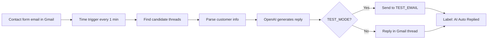

# AI Auto Response

Google Apps Script that automatically replies to Without A Trace website contact form emails using OpenAI. Replies are personalized to the customer's message and follow Michael Ehrlich's business rules and tone.

## Features

- Monitors Gmail for new web request / contact form emails
- Parses customer name, email, and message from form notifications
- Generates personalized replies via OpenAI (`gpt-4o-mini`)
- Appends shipping URL, store locations, and signature automatically
- **Test mode** — sends replies only to a test inbox
- **Live mode** — replies inside the original Gmail thread
- Labels processed threads (`AI Auto Replied`) and errors (`AI Auto Reply Error`)
- Rate limits: max 2 replies per run, checks up to 30 threads
- Emergency stop function to disable the time-based trigger

## Prerequisites

- A Google account with Gmail access
- An [OpenAI API key](https://platform.openai.com/api-keys)
- Website contact form emails delivered to Gmail (e.g. Contact Form 7 with `Reply-To: [your-email]`)
- Gmail labels such as `Web Requests` (optional but recommended)

## Setup

### 1. Create the Apps Script project

1. Open [Google Apps Script](https://script.google.com/)
2. Create a new project
3. Paste the contents of `script.js` into `Code.gs`
4. Save the project

### 2. Add your OpenAI API key

1. In Apps Script: **Project Settings** (gear icon) → **Script Properties**
2. Add a property:
   - **Property:** `OPENAI_API_KEY`
   - **Value:** your OpenAI API key

### 3. Configure settings

Edit the `CONFIG` object at the top of `script.js`:

| Setting | Description |
|---------|-------------|
| `TEST_MODE` | `true` = send to test email only; `false` = reply in thread |
| `TEST_EMAIL` | Inbox used when `TEST_MODE` is `true` |
| `MICHAEL_EMAIL` | Reply-To address on outgoing emails |
| `SHIPPING_URL` | Link appended to every reply |
| `MAX_EMAILS_TO_SEND_PER_RUN` | Cap per 1-minute run (default: 2) |

**Always start with `TEST_MODE: true`** until replies look correct.

### 4. Authorize and start

1. Run `testOpenAiApiKey` once to verify the API key
2. Run `setupAiAutoReplySystem` to:
   - Create Gmail labels
   - Clear old processing flags
   - Set a start timestamp (older emails are ignored)
   - Create a 1-minute time-based trigger

## How it works

```
Gmail (new web request) → find candidate threads → parse customer info
    → OpenAI generates reply → append business footer → send reply
    → label thread as processed
```

The script searches for emails matching patterns like "Without A Trace CONTACT FORM", "Web Request", or labeled threads. It skips replies, forwards, test messages, and emails received before setup.



## Main functions

| Function | When to run |
|----------|-------------|
| `setupAiAutoReplySystem` | After saving code or resetting the system |
| `emergencyStopAiAutoReplySystem` | Stop the trigger immediately if something loops |
| `testOpenAiApiKey` | Verify OpenAI credentials |
| `autoSendAiRepliesForNewWebRequests` | Runs automatically every minute (do not run manually unless debugging) |

## Safety

- **Test mode first** — no customer emails until you are confident
- **Start time** — only emails after `setupAiAutoReplySystem` are processed
- **Duplicate protection** — script properties track processed message IDs
- **Lock** — only one run at a time
- **Error label** — failed threads get `AI Auto Reply Error` for review

## Troubleshooting

| Issue | What to check |
|-------|----------------|
| `Missing OPENAI_API_KEY` | Add key in Script Properties |
| No replies sent | Confirm `TEST_MODE`, check Gmail search matches your form subject/body |
| Replies go to wrong address | Contact Form 7 Mail 1 should set `Reply-To: [customer-email]` |
| Too many emails | Run `emergencyStopAiAutoReplySystem`, then fix and re-run setup |
| OpenAI API error | Check API key, billing, and model availability |

## Gmail labels used

- `AI Auto Replied` — successfully processed
- `AI Auto Reply Error` — processing failed
- `Web Requests` — applied when that label exists (optional)

## License

Private / internal use for Without A Trace.
